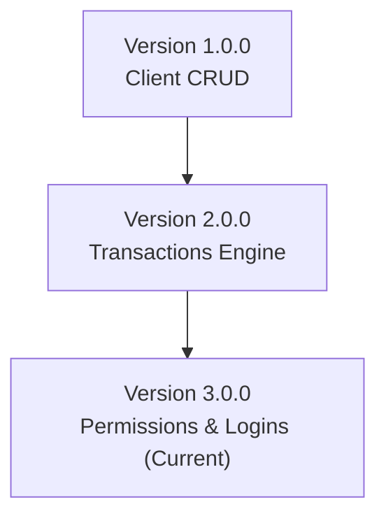
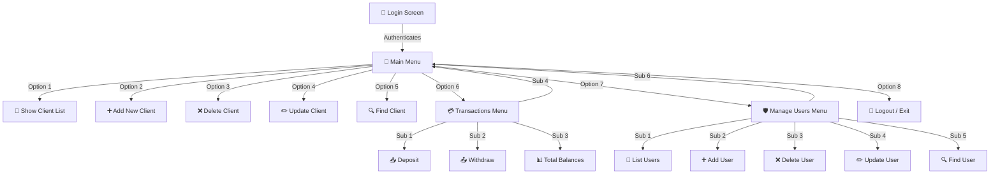

# 🏦 Bank Management System (C++ Console Application)


A comprehensive, console-based banking management application written in modern C++. This project demonstrates structured programming, file-based persistence, security management, and bitwise permission control. 

This repository has evolved through three distinct development phases, each adding critical features to build a complete banking simulation.

---

## 📋 Table of Contents

- [📌 Project Overview](#-project-overview)
- [🚀 Release History & Roadmap](#-release-history--roadmap)
  - [Version 1.0.0 — Initial Release (Client Management)](#version-100--initial-release-client-management)
  - [Version 2.0.0 — Transactions Extension](#version-200--transactions-extension)
  - [Version 3.0.0 — Security & Permissions Extension (Current)](#version-300--security--permissions-extension-current)
- [📁 Project Directory Structure](#-project-directory-structure)
- [💾 Data Persistence & Database Architecture](#-data-persistence--database-architecture)
- [⚙️ Bitwise Permission System](#️-bitwise-permission-system)
- [🖥️ Application Interfaces & Navigation Flow](#️-application-interfaces--navigation-flow)
- [💻 System Requirements & Build Guide](#-system-requirements--build-guide)
- [📄 License & Credits](#-license--credits)

---

## 📌 Project Overview

The **Bank Management System** is a C++ application designed to demonstrate practical software development concepts, including:

- **Structured programming** fundamentals.
- **File handling (`fstream`)** and delimiter-based flat-file databases.
- **CRUD operations** for both client records and operator user records.
- **Bitwise permissions masking** for feature authorization.
- **Input validation** and CLI menus.
- **Release management and version progression** (v1.0.0 to v3.0.0).

The system manages client and staff accounts through an interactive console interface while storing data permanently in local flat-text files.

---

## 🚀 Release History & Roadmap

The application has been built iteratively, tracking the transition from a simple record system into an authorized banking portal:



### Version 1.0.0 — Initial Release (Client Management)
**Status:** Completed ✅

Focused on core record-keeping and database management for bank clients:
*   **Show Client List:** Displays a formatted table of all clients registered in the system (Account Number, PIN, Name, Phone, and Balance).
*   **Add New Client:** Register new clients with duplicate checking (prevents duplicate account numbers) and automatically saves new records.
*   **Delete Client:** Locates a client record by Account Number, requests confirmation, and updates the file database.
*   **Update Client Info:** Modifies client properties (PIN Code, Name, Phone, and Balance) upon confirmation.
*   **Find Client:** Performs a quick search by Account Number and prints their profile details.
*   **Data Persistence:** Saves all data into `Clients.txt` using the custom separator `#//#`.

---

### Version 2.0.0 — Transactions Extension
**Status:** Completed ✅

Introduced transaction processing and core financial calculations inside a dedicated Transactions Menu:
*   **Deposit Operations:** Add funds to any client's account balance with validation.
*   **Withdrawal Operations:** Withdraw funds from a client's account with validation to prevent overdrafts (checks if the requested amount does not exceed the current balance).
*   **Total Balances Inquiry:** Calculates and displays the total sum of balances held by the bank, alongside individual client balances.

---

### Version 3.0.0 — Security & Permissions Extension (Current)
**Status:** Completed ✅ | **Current Version** 🟢

Adds user roles, authentication, and security protections to control menu interactions:
*   **Secure Authentication System:** A login screen requiring a Username and Password matched against `Users.txt` before entering the application.
*   **User Management Sub-Menu:** Allows authorized administrators to perform full CRUD operations for staff operator user profiles (`List`, `Add`, `Delete`, `Update`, `Find`).
*   **Bitwise Permission-Based Authorization:** Checks the currently logged-in user's permission bitmask before executing any main menu command. Unauthorized access results in an **"Access Denied"** warning screen.

---

## 📁 Project Directory Structure

```text
Bank-Management-System/
│
├── bank_project.cpp         # Main C++ application source code
├── Clients.txt              # Delimiter-separated client database file
└── Users.txt                # Delimiter-separated user/operator database file
README.md                # Comprehensive documentation (this file)
```

---

## 💾 Data Persistence & Database Architecture

Data is stored locally in text files using the custom delimiter `#//#` to separate fields.

### 1. Clients Database (`Clients.txt`)
Stores individual client accounts:
*   **Format:** `AccountNumber#//#PinCode#//#ClientName#//#PhoneNumber#//#AccountBalance`
*   **Example Record:**
    ```text
    C101#//#1111#//#John Doe#//#07777777#//#5000.000000
    C102#//#2222#//#Jane Doe#//#08888888#//#2000.000000
    ```

#### Client Data Model
| Field | Data Type | Description |
| :--- | :--- | :--- |
| **Account Number** | `string` | Unique identifier key |
| **PIN Code** | `string` | Access code for the client |
| **Client Name** | `string` | Full name of the client |
| **Phone Number** | `string` | Contact phone number |
| **Account Balance** | `double` | Current account balance |

---

### 2. Users Database (`Users.txt`)
Stores bank operators credentials and authorization roles:
*   **Format:** `UserName#//#Password#//#Permissions`
*   **Example Record:**
    ```text
    Admin#//#1234#//#-1
    Teller1#//#5678#//#37
    ```

#### User Data Model
| Field | Data Type | Description |
| :--- | :--- | :--- |
| **User Name** | `string` | Unique login handle |
| **Password** | `string` | Secure login password |
| **Permissions** | `int` | Integer value representing access permissions bitmask |

---

## ⚙️ Bitwise Permission System

Permissions are managed using a bitwise representation, storing multiple access flags inside a single integer value.

### Permission Mapping Table

| Feature / Menu Option | Enum Value | Binary Bit | Decimal Value | Description |
| :--- | :---: | :---: | :---: | :--- |
| **Full Access (Admin)** | `eAll` | *All Bits Set* | `-1` | Grants access to all features |
| **Show Client List** | `pListClients` | `2^0` (Bit 0) | `1` | View client table |
| **Add New Client** | `pAddNewClient` | `2^1` (Bit 1) | `2` | Register new clients |
| **Delete Client** | `pDeleteClient` | `2^2` (Bit 2) | `4` | Remove client records |
| **Update Client** | `pUpdateClients` | `2^3` (Bit 3) | `8` | Modify client records |
| **Find Client** | `pFindClient` | `2^4` (Bit 4) | `16` | Search for clients |
| **Transactions Menu** | `pTranactions` | `2^5` (Bit 5) | `32` | Access deposit, withdraw, total balances |
| **Manage Users Menu** | `pManageUsers` | `2^6` (Bit 6) | `64` | Access user registration menu |

> 💡 **Calculating Permission Values:**  
> Sum the decimal values of the features you wish to grant. For instance, to allow a teller to View Clients (`1`), Search Clients (`16`), and perform Transactions (`32`), assign their account a permission value of `1 + 16 + 32 = 49`.

---

## 🖥️ Application Interfaces & Navigation Flow

### Login Screen Mockup
```text
==================================
            LOGIN SCREEN
==================================
Enter Username? Admin
Enter Password? ****
```

### Main Menu Interface Mockup

```text
==================================
         MAIN MENU SCREEN
==================================
[1] Show Client List
[2] Add New Client
[3] Delete Client
[4] Update Client Info
[5] Find Client
[6] Transactions
[7] Manage Users
[8] Logout
==================================
Choose [1 to 8]? _
```

### Transactions Menu Interface Mockup

```text
==================================
      TRANSACTIONS MENU
==================================
[1] Deposit
[2] Withdraw
[3] Total Balances
[4] Main Menu
==================================
Choose [1 to 4]? _
```

### Manage Users Menu Mockup

```text
==================================
       MANAGE USERS MENU
==================================
[1] List Users
[2] Add New User
[3] Delete User
[4] Update User
[5] Find User
[6] Main Menu
==================================
Choose [1 to 6]? _
```

### System Flowchart


---

## 💻 System Requirements & Build Guide

### Requirements
*   **Compiler:** GCC (g++), Clang++, or MSVC supporting **C++11 or later** (C++17 recommended).
*   **Operating System:** Currently optimized for **Windows** (uses `system("cls")` and `system("pause")` commands for terminal control).

---


### Running in Microsoft Visual Studio
1. Open Visual Studio and create a new **Console App (C++)** project.
2. Replace the contents of the main source file (e.g., `ConsoleApplication1.cpp`) with the code from [`bank_project.cpp`](file:///d:/Bank%20project/bank%20project.cpp).
3. Ensure [`Clients.txt`](file:///d:/Bank%20project/Clients.txt) and [`Users.txt`](file:///d:/Bank%20project/Users.txt) are placed in the same directory as the project's build directory or outputs.
4. Press **Ctrl + F5** to compile and run the console app.

---

## 📄 License & Credits

- **Author:** Mohammed Abdo Rashed
- **Purpose:** This project was developed for educational and portfolio purposes.
- **Notice:** You are welcome to study and learn from this project. Please do not redistribute or claim the code as your own without permission.
